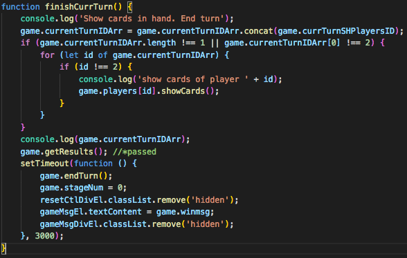

# Texas Holdem - GA Project 1

## Table of Content
* [Introduction](#Introduction)
* [Development](#Development)
* [Conclusion](#Conclusion)

<br>

## Introduction
This is a desktop web based card game with one player and 4 computer. Currently, game info will refresh everytime when page load.

### About Texas Holdem
Texax Holdem is a popular card game with calculation and strategies. Each round a player will get 2 cards in hands, and 5 shared card showing on table with displaying 3 cards, 1 card and 1 card order. There are several stages in a round. At each stage, players can choos check, raise and fold their bet in this around. In the end, depending on the cards combination of each player, the player has the highest ranking combination wins the game and takes all the bets. For more information, please check [wiki](https://en.wikipedia.org/wiki/Texas_hold_%27em) and [WSOP](http://www.wsop.com/poker-games/texas-holdem/).

### Project Background
This is the open project 1 in my General Assembley Software Immersive Bootcamp. The goal is to fully apply HTML, CSS and Javascript skills to develop a web application. After the self developing experience in hangman(link) and group developing experience in tic tac toe (link), I would like to further challenge and develop my skill with Texas Holdem.

### Preview of Final App
| Start of game | End of game |
|:-------------:|:-----------:|
| ![start game][start] | ![end game][end]

[start]: ./readme_files/startgame15fps.gif
[end]: ./readme_files/endgame15fps.gif

### Built with
* HTML, CSS, Javascript
* Development Envirtonment: VS Code
* Version Control: Github

<br>

## Development
Below are explanations for name used:
* game: start from player with inital funds until he/she runs out fund after rounds.
* turn: or round. Start with intial bet before get hand and end with show all shared cards on table or only one active player (not fold, showhand or out of funds) in this round.
* stage: different phases in a round. often includes: blind, get hand, show flop, show turn, show river and check result. 
* gamer: refers to real person player in game.
* player: refers to either computer and gamer.

| Interface | Game Logic |
| ----------------------- | ------------------------- |
| ![interface][interface] | ![game logic][game_logic] |

[interface]: ./readme_files/handdraft-UI.png
[game_logic]: ./readme_files/handdraft-codeflow.png

### Construct the Game Flow
From the Game Logic, it can be seen that a game has repetitive rounds. In rounds, they have different stages (blind, get hand, show flop, show turn, show river and check result). In each stage, players can check, fold and raise. Once flow for a game round  is constructred. It can be used again and again until the end of them game.
However, the challenges are active players in a game and a game round is dependning on the player activity, and end of each stage is also depending on the player activity. Parameters are set, and updated on every player activity.
* currentPlayerIDArr: IDs of players in game (player with $0 will be move out. If gamer is moved, game will be end)
* currentTurnIDArr: IDs of players in current game round (player fold or showhand will be moved out. If gamer is moved out, or only one player left, the game will automatic processed to the end)
* players: array of player instance with game related info (cards, bet, fund...)of each player
* ...other parameters for tracking bet, showhand, startbetplayer can be found the poker.js

### Stage Control
Stage control of game is implemented with 3 main parameters: stageNum: number, stageEnd: boolean and below function:
```javascript
  // start script.js line 241
  function nextStage() {
    // check whether end should be end (if gamer is out or only one player)
    {stage_control} { // image below
      // let dealer show cards at corresponding stage
      // check whether should ask player to play: 
      askNextPlayerBet()
      // Or compare the hand of players to get result:
      finishCurrTurn()
    } 
  }
```
**{stage_control}**
* showNextDealerCard(startCardIndex, endCardIndex): reveal dealer cards on board depending on the arguments.
* initTurnIndex(): initiate index for the coming stage based on the tracking parameters mentioned above.
* askNextPlayerBet(): check whether should go to next stage. if not, find the next player based on the tracking parameters, let them take acitivity (explained after). Notice a delay was set for this function. It will be explain further in Gamer Experience section.

_stage_control.png)

**askNextPlayerBet()**
* the function will decide whether the game should be processed to next stage by call nextStage() if condition (turnCurrIndex === turnEndIndex ) meets.
* Or call computerBet() or show control penal for gamer if it is their turn. computerBet() is a function controls computer activity depding on their 'character' (see more in Computer Player Activity and Character section).
* notice delays were also set when call these functions. This is also for game experience consideration (see more in Game Experience section)

.png)

**finishCurrTurn()**
At the end of a turn (round), this function will be called. It will do 3 things:
* Show cards on hand for each active player: showCards()
* Get results (winner(s), win amount) for players: getResults(), (see more in Checking Winner Algorithm)
* End current turn (round): endTurn()



### Computer Player Activity and Character
Computer acitivities (check, fold and raise) is triggered by askNextPlayerBet() above, and controlled by computerBet() (poker.js line 111). It will know which player is taking action by the player argument passed in which decided by the turnCurrIndex.

**computerBet()**
* Decide action based on the chip in hand and character of current player.
* Right now, the character of current player is set to be identical by betOptionCtl and switch. It can be further refined by introduce new algorithm to obtain betOptionCtl to let computer be aggressive or comserative.
* Based on the situation, computer will may fold, check, raise by call the corresponding functions: Fold(), Call() and Raise().

.png)


### Checking Winner Algorithm
The checking winner mechanism is in the getResults() function trigger by finishCurrTurn() when stageNum = 4 in nextStage() (see more in Stage Control). In the getResult(), the cards of active players in the current round will be checked by getHandRank(). It will store an array containing [score, [high cards for tie break], winning message].

|        |straight<br>flush|four<br>kinds|full<br>house|flush|straight|three<br>kinds|two<br>pairs|one<br>pair| nothing |
|:------:|:--------:|:--:|:---------:|:-----:|:------:|:----:|:-------------------:|:----:|:----:|
| acronym|    sf    | fk | tk & pair | flush |straight|  tk  | length<br>of pair[] | pair |      |
| score  |   9, 8   | 7  |     6     |   5   |    4   |   3  |        2            |  1   |   0  |

```javascript
  function getHandRank() { //poker.js line 425
    // count cards (player hand + dealer cards) by suit and number
    // suitecount: {heart: 3, diamond 2};
    // numbercount: {3: 2, 4: 2}
    getHandStat(hand);

    // check fk, fh, tk, pair by using number count
    for (key in nmbercount) {
      //  poker.js line 442
    }
    
    // check straight by using keys for numbercount
    numKeys = Object.keys(numbercount); //*accent, numArr
    let codeKeys = this.CodifyNumArr(numKeys); //*accent, codeArr
    straight = this.checkStraight(numKeys); //*decent, numArr passed
    
    // check for flush with suitcount
    flush = this.checkFlush(suitcount); //* passed, unsorted numArr;
    //if flush, check whether it is sf (straight flush)
    //* sort flush[1]
    let flusharry = this.CodifyNumArr(flush[1]).sort();
    flusharry = this.numCodeArr(flusharry);
    sf = this.checkStraight(flusharry); //* passed;

    //check for the high ranking combination
    //poker.js line 476
  }

```

### Game Experience
As briefly mentioned above, for better game experience, time outs are introduced when some of the functions are called. This is because the sychronicity of javascripts. Functions in sync will happen at the same. It results when computer players take activities, they will complete simultaneously within 1s instead of what is showing in the preview that actions happend by turns. It is hard for gamer even for me to track what is going on. (Actually, I have to depend on my console log during development for a long time. That sucks). 
In order to have a better experience, these delays and message pop are introduced.

<br>

## References
* Deck of Cards API: generating random cards and cards image for each game. ([link](https://deckofcardsapi.com/))
* W3School: for CSS, HTML and Javascript documents. ([link](https://www.w3schools.com/))
* Stack Overflow: for quesionts and errors. ([link](https://stackoverflow.com/))


